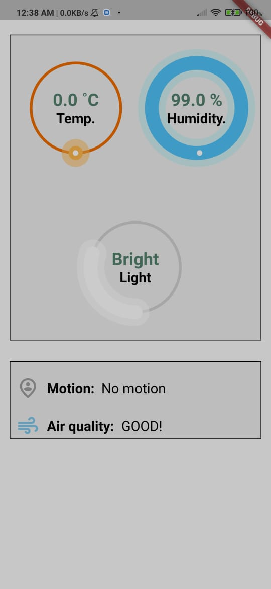

# Smart_Home
an IOT smart home using Arduino and integrated with a mobile app built with flutter.

We will use two sensors which are DHT11 for measuring temperature/humidity, and MQ135 sensor for determining the air quality. Both a humidifier and a 5V DC fan were used as actuators to adjust humidity and air quality in specific ranges.

1[screenshot2](./6c6984d1-6a97-4070-af76-4eec702e4f8c.jpg)

